<h1 align="center">Hi 👋, I'm Farhad</h1>

  

- 🔭 I’m currently working on **Hushmand Shahar Information Technology**

- 🌱 I’m currently learning **LARAVEL 12 React and Next**

- 👯 I’m looking to collaborate on **PMS**

- 💬 Ask me about **REACT, NEXT.JS**

- 📫 How to reach me **farhadwardak2018@gmail.com**

<h3 align="left">Connect with me:</h3>
Whatsapp: 0728063532

<h3 align="left">Languages and Tools:</h3>

                 

